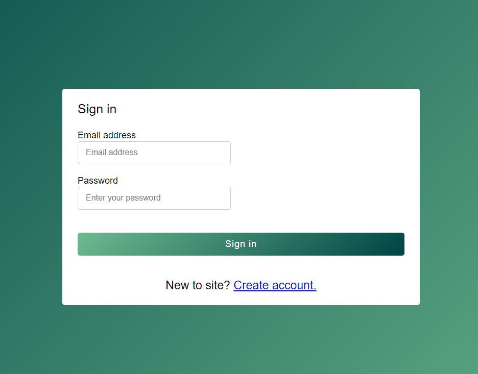
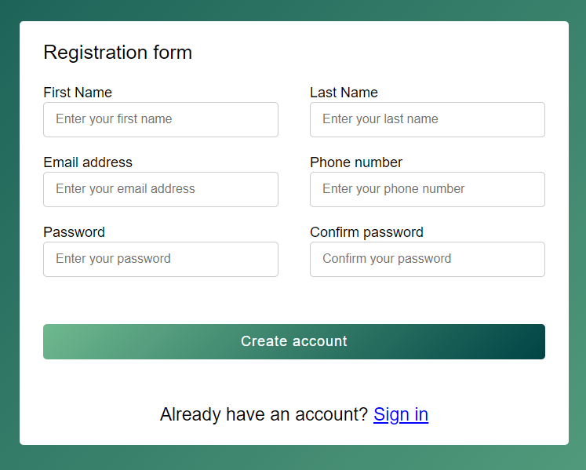
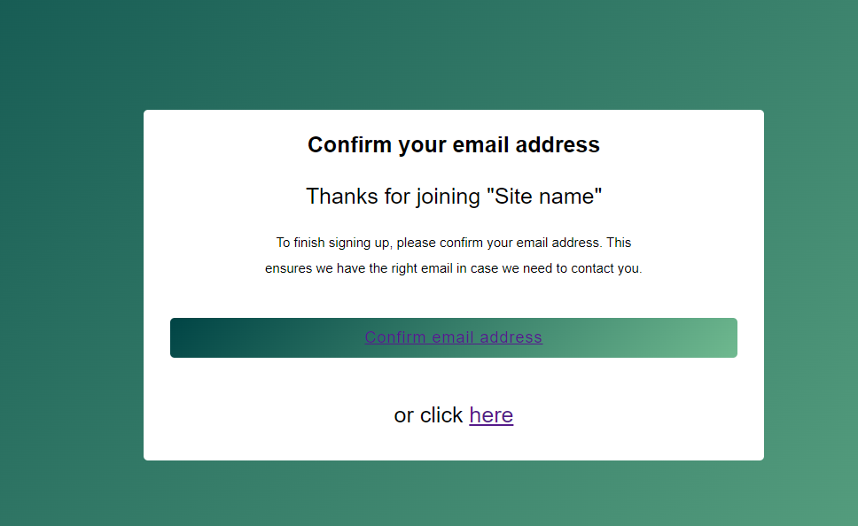
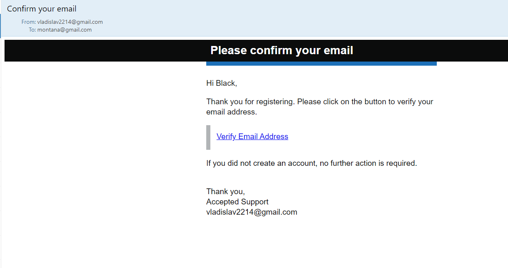
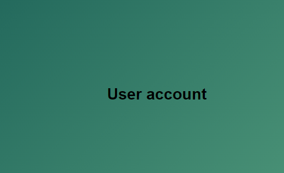
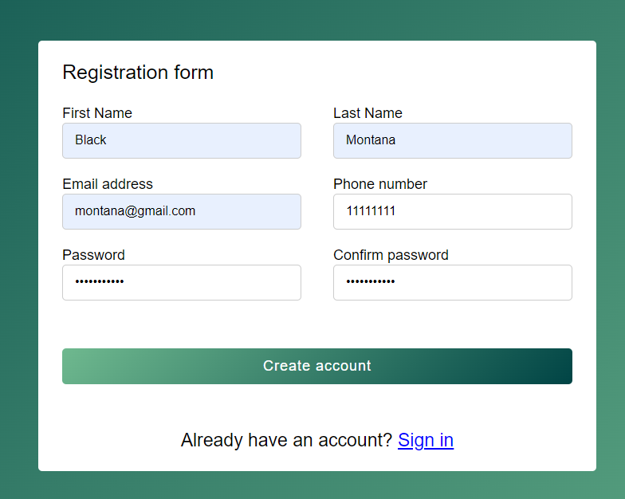

# My registration form

- [x] Spring Boot
- [x] Spring Security
- [x] Java Mail
- [x] Email verification with expiry


## Main page(login page)



## Registration page



## Page with request confirm your email address



## Email verification link with expiry



## User account page



## Example request


### CURL
```
curl --location --request POST 'localhost:8080/api/v1/registration' \
--header 'Content-Type: application/json' \
--data-raw '{
    "firstName": "Black",
    "lastName": "Montana",
    "email": "montana@gmail.com",
    "phoneNumber": "11111111",
    "password": "123password",
    "confirmPassword": "123password"
}'
```